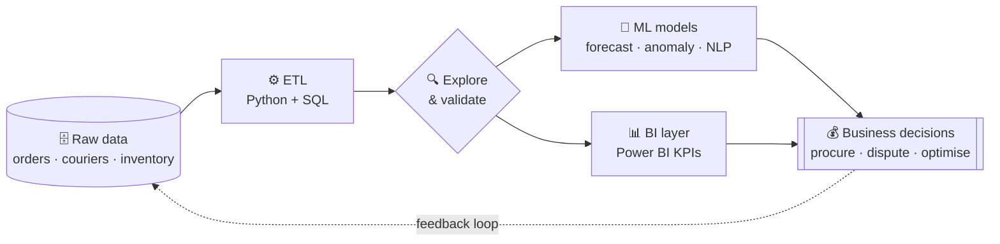
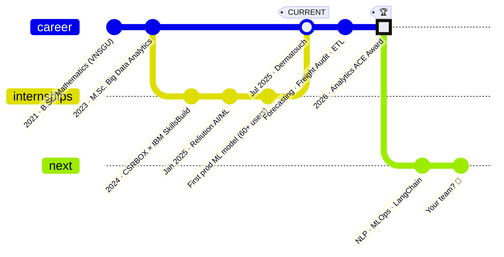

<!-- ═══════════════════════════════════════════════════════════════
     HEMAL SUREJA — GitHub Profile README  (v2 · "advanced")
     Repository: hemalsureja/hemalsureja
     Needs: .github/workflows/snake.yml  (for the contribution snake)
     ═══════════════════════════════════════════════════════════════ -->

<!-- ── HERO BANNER (auto-switches with GitHub light / dark theme) ── -->
<picture>
  <source media="(prefers-color-scheme: dark)" srcset="https://capsule-render.vercel.app/api?type=venom&color=0:0D1117,45:1558B0,100:2EA043&height=230&section=header&text=Hemal%20Sureja&fontSize=62&fontColor=F0F6FC&fontAlignY=40&desc=I%20turn%20messy%20data%20into%20money-saving%20decisions&descAlignY=62&descSize=18&descColor=A8C8F8&animation=twinkling&stroke=58A6FF&strokeWidth=1" />
  
</picture>

<div align="center">

<!-- ── TYPING LINE ─────────────────────────────────────────────── -->
<a href="https://github.com/hemalsureja">
  
</a>

<!-- ── BADGES ──────────────────────────────────────────────────── -->
<p>
  <a href="https://linkedin.com/in/hemalsureja"></a>
  <a href="mailto:hemalsureja999@gmail.com"></a>
  <a href="https://kaggle.com/hemalsureja69"></a>
  
  
</p>


</div>

<br/>

> [!TIP]
> **🏆 Analytics ACE Award** — recognised by the Data & Insights team at the **Dermatouch × Wipro Synergy 2026** event for analytics impact across the business.

<br/>

<!-- ══════════════════════════════════════════════════════════════
     ABOUT
     ══════════════════════════════════════════════════════════════ -->

## 🧬 &nbsp;`whoami`

<table>
<tr>
<td width="58%" valign="top">

```python
class HemalSureja(DataPerson):
    """Mathematician by training, analyst by trade,
       ML engineer by obsession."""

    role       = ["Jr. Data Analyst", "Jr. Data Scientist"]
    company    = "Dermatouch · D2C Skincare"
    base       = "Ahmedabad, India  (remote-friendly)"
    education  = "M.Sc. Big Data Analytics · B.Sc. Mathematics"

    daily_stack = ["Python", "SQL", "Power BI", "XGBoost"]
    ships       = ["forecasts", "anomaly detectors",
                   "ETL pipelines", "KPI dashboards"]
    learning    = ["MLOps", "MLflow", "LangChain", "Streamlit"]

    def superpower(self):
        return "finding the ₹ hiding inside the spreadsheet"

    def next_move(self):
        return "Data Analyst / Jr. DS role → let's talk 👋"
```

</td>
<td width="42%" valign="top">

#### ⚡ Right now

🟢 &nbsp;Running **production ML** at Dermatouch  
📦 &nbsp;SKU **demand forecasting** (ARIMA + XGBoost)  
🚚 &nbsp;Auditing **7+ courier partners** for billing leaks  
💬 &nbsp;Building an **NLP sentiment pipeline**  
📊 &nbsp;Shipping **Power BI KPI** dashboards  
🧪 &nbsp;Learning **MLflow · LangChain · Streamlit**

#### 💬 Ask me about

`demand forecasting` · `SQL tuning`  
`logistics analytics` · `D2C / eCom KPIs`  
`imbalanced classification` · `Power BI DAX`

</td>
</tr>
</table>

<!-- ══════════════════════════════════════════════════════════════
     IMPACT
     ══════════════════════════════════════════════════════════════ -->

## 📈 &nbsp;Impact, not just code

<div align="center">

<table>
<tr>
<td align="center" width="16%"><h1>75%</h1><sub>less manual reporting<br/>via ETL automation</sub></td>
<td align="center" width="16%"><h1>~10%</h1><sub>monthly logistics<br/>cost recovered</sub></td>
<td align="center" width="16%"><h1>30%</h1><sub>fewer overstock<br/>instances</sub></td>
<td align="center" width="16%"><h1>60+</h1><sub>users on my<br/>production CV model</sub></td>
<td align="center" width="16%"><h1>10+</h1><sub>BI dashboards<br/>deployed</sub></td>
<td align="center" width="16%"><h1>1M+</h1><sub>records analysed<br/>in production</sub></td>
</tr>
</table>

</div>

### 🔁 &nbsp;How I work — raw data ➜ decisions



<!-- ══════════════════════════════════════════════════════════════
     PROJECTS
     ══════════════════════════════════════════════════════════════ -->

## 🚀 &nbsp;Featured work &nbsp;<sub><sup>click a project to open the case study</sup></sub>

<details open>
<summary><b>🚚 Logistics Freight Audit Framework</b> &nbsp;—&nbsp; <code>~10% monthly cost recovery</code> &nbsp;·&nbsp; Dermatouch</summary>
<br/>

| | |
|---|---|
| **Problem** | Courier invoices across 7+ partners were checked by hand — overcharges (weight slabs, RTO fees, duplicate AWBs) slipped through. |
| **Approach** | Python + SQL pipeline reconciles every invoice line against order/weight master data; rule-based + statistical anomaly detection flags outliers; dispute reports are auto-generated per partner. |
| **Impact** | **~10% of monthly logistics spend recovered**, audit time cut from days to minutes, Power BI view for finance. |
| **Stack** |     |

</details>

<details>
<summary><b>📦 Demand Forecasting — Inventory Optimisation</b> &nbsp;—&nbsp; <code>30% less overstock</code> &nbsp;·&nbsp; Dermatouch</summary>
<br/>

| | |
|---|---|
| **Problem** | Procurement relied on gut feel → some SKUs overstocked while bestsellers ran out. |
| **Approach** | SKU-level hybrid model: ARIMA captures trend/seasonality, XGBoost learns residuals from promo, price and channel features. Trained on 12 months of sales. |
| **Impact** | **30% drop in overstock instances**; forecasts now feed procurement planning directly. |
| **Stack** |     |

</details>

<details>
<summary><b>👁️ Face Recognition Attendance System</b> &nbsp;—&nbsp; <code>60+ users in production</code> &nbsp;·&nbsp; Reliution</summary>
<br/>

| | |
|---|---|
| **Problem** | Manual attendance in the ERP was slow and error-prone. |
| **Approach** | Real-time face detection & recognition with OpenCV + pre-trained dlib embeddings, served through Flask and integrated into the Odoo ERP backend. |
| **Impact** | The team's **first production ML model** — manual attendance eliminated for **60+ users**. |
| **Stack** |     |

</details>

<details>
<summary><b>🏦 Loan Delinquency Prediction</b> &nbsp;—&nbsp; <code>89% accuracy</code> &nbsp;·&nbsp; Hackathon</summary>
<br/>

| | |
|---|---|
| **Problem** | Predict which borrowers will default on a heavily imbalanced dataset. |
| **Approach** | End-to-end pipeline: feature engineering → SMOTE balancing → XGBoost → decision-threshold tuned for lender risk appetite. |
| **Impact** | **89% classification accuracy** with a threshold that trades recall vs. false alarms explicitly. |
| **Stack** |     |

</details>

<details>
<summary><b>💬 NLP Sentiment Pipeline</b> &nbsp;—&nbsp; <code>🔄 in progress</code></summary>
<br/>

Mining customer reviews to surface product-level sentiment and recurring complaints — feeding product and CX teams. Stack: `Python` · `NLTK` · `Scikit-learn` · soon `LangChain`.

</details>

<!-- ══════════════════════════════════════════════════════════════
     TECH STACK
     ══════════════════════════════════════════════════════════════ -->

## 🛠️ &nbsp;Toolbox

<div align="center">

<a href="#"></a>
<br/><br/>
<a href="#"></a>

<br/><br/>


</div>

<details>
<summary><b>📊 Proficiency breakdown</b></summary>
<br/>

```text
Python  / Pandas     ████████████████████░   95%
SQL (MySQL, PG)      ███████████████████░░   90%
Power BI / DAX       ██████████████████░░░   85%
Scikit-learn/XGBoost █████████████████░░░░   80%
Time-series (ARIMA)  ████████████████░░░░░   75%
Computer Vision      ██████████████░░░░░░░   65%
NLP                  ████████████░░░░░░░░░   55%   ↗ levelling up
MLOps (MLflow)       ████████░░░░░░░░░░░░░   40%   ↗ levelling up
```

</details>

<!-- ══════════════════════════════════════════════════════════════
     JOURNEY  (git-graph — because a data person's career is version-controlled)
     ══════════════════════════════════════════════════════════════ -->

## 🗺️ &nbsp;`git log --career`



<!-- ══════════════════════════════════════════════════════════════
     GITHUB ANALYTICS
     ══════════════════════════════════════════════════════════════ -->

## 📡 &nbsp;GitHub analytics

<div align="center">

<picture>
  <source media="(prefers-color-scheme: dark)" srcset="https://github-readme-stats.vercel.app/api?username=hemalsureja&show_icons=true&include_all_commits=true&count_private=true&theme=github_dark&hide_border=true&title_color=58A6FF&icon_color=2EA043&rank_icon=github" />
  
</picture>
<picture>
  <source media="(prefers-color-scheme: dark)" srcset="https://github-readme-stats.vercel.app/api/top-langs/?username=hemalsureja&layout=compact&langs_count=8&theme=github_dark&hide_border=true&title_color=58A6FF" />
  
</picture>

<picture>
  <source media="(prefers-color-scheme: dark)" srcset="https://streak-stats.demolab.com?user=hemalsureja&theme=github-dark-blue&hide_border=true&ring=2EA043&fire=2EA043&currStreakLabel=58A6FF" />
  
</picture>

<picture>
  <source media="(prefers-color-scheme: dark)" srcset="https://github-readme-activity-graph.vercel.app/graph?username=hemalsureja&bg_color=0D1117&color=58A6FF&line=2EA043&point=F0F6FC&area=true&area_color=1558B0&hide_border=true&custom_title=Contribution%20activity" />
  
</picture>

<!-- Snake eats the contribution grid — generated by .github/workflows/snake.yml -->
<picture>
  <source media="(prefers-color-scheme: dark)" srcset="https://raw.githubusercontent.com/hemalsureja/hemalsureja/output/github-snake-dark.svg" />
  
</picture>

</div>

<!-- ══════════════════════════════════════════════════════════════
     RECRUITER CORNER
     ══════════════════════════════════════════════════════════════ -->

## 🎯 &nbsp;Recruiter corner

```sql
-- Looking for your next Data Analyst / Jr. Data Scientist?
SELECT  name, role, superpower
FROM    candidates
WHERE   skills   @> ARRAY['Python','SQL','Power BI','ML']
  AND   impact   =  'measured in ₹, not in notebooks'
  AND   award    =  'Analytics ACE 2026'
  AND   location IN ('Ahmedabad', 'Remote')
ORDER BY curiosity DESC
LIMIT   1;

-- ┌───────────────┬──────────────────────────────┬─────────────────────────────┐
-- │ name          │ role                         │ superpower                  │
-- ├───────────────┼──────────────────────────────┼─────────────────────────────┤
-- │ Hemal Sureja  │ Data Analyst / Jr. DS        │ finds the ₹ in the data     │
-- └───────────────┴──────────────────────────────┴─────────────────────────────┘
-- (1 row)  ✅  Execution time: 1 message on LinkedIn
```

<details>
<summary><b>⏱️ 30-second TL;DR</b></summary>
<br/>

- **1+ year** of production analytics & ML at a fast-growing D2C skincare brand  
- Proven, **business-measured** wins: cost recovery, overstock reduction, reporting automation  
- Comfortable end-to-end: **SQL → Python → model → dashboard → stakeholder**  
- **Analytics ACE Award** winner, Dermatouch × Wipro Synergy 2026  
- Based in **Ahmedabad**, open to on-site or remote

</details>

<!-- ══════════════════════════════════════════════════════════════
     CONNECT
     ══════════════════════════════════════════════════════════════ -->

<div align="center">

## 🤝 &nbsp;Let's build something with data

[](https://linkedin.com/in/hemalsureja)
[](mailto:hemalsureja999@gmail.com)
[](https://kaggle.com/hemalsureja69)

<sub>⭐ If a repo here helped you, a star makes my day · Last deploy: automated via GitHub Actions</sub>

</div>

<picture>
  <source media="(prefers-color-scheme: dark)" srcset="https://capsule-render.vercel.app/api?type=waving&color=0:2EA043,50:1558B0,100:0D1117&height=120&section=footer" />
  
</picture>
